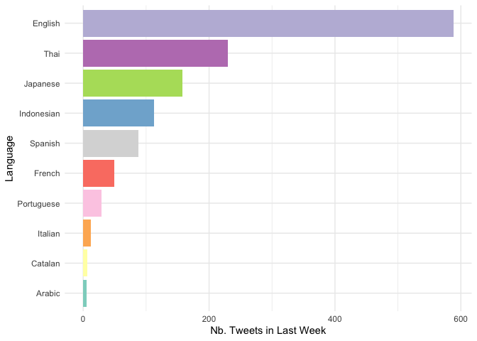
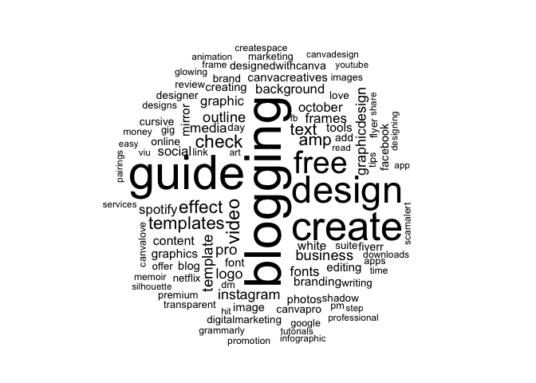
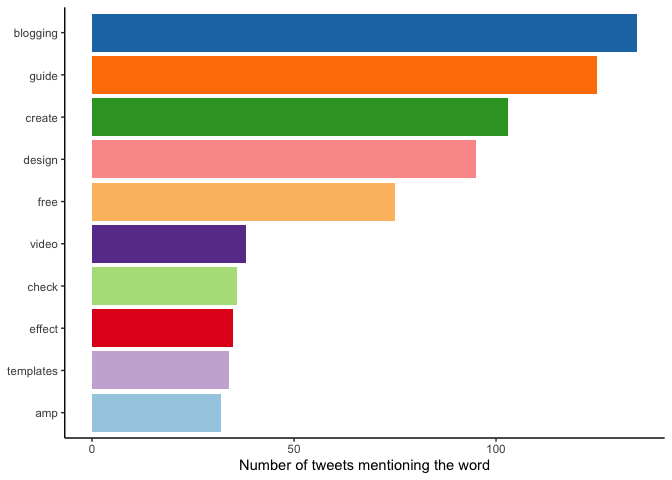
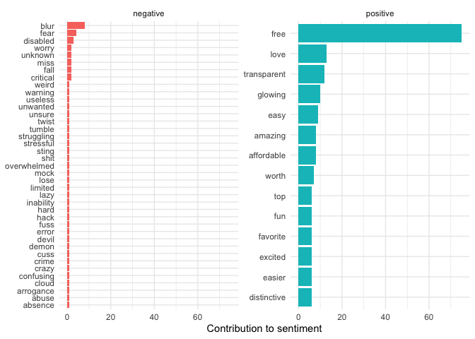
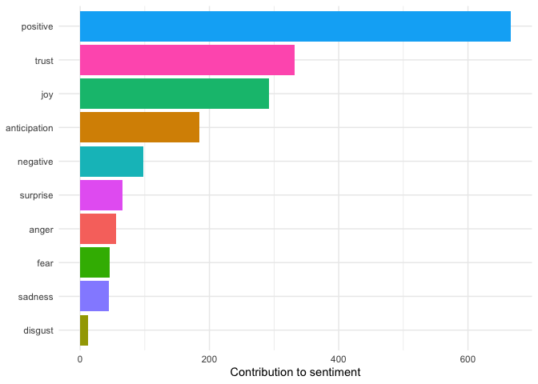

Canva Sentiment Analysis
================
Mahiko Konishi
10/18/2021

## Get tweets

The first step is to recover the tweets from the past week with the
hashtag \#canva.

``` r
canva <- search_tweets('#canva', n=2000, include_rts = FALSE, retryonratelimit = TRUE, type='mixed')
```

## Countries

These tweets are coming from all over the world. Let’s check in which
countries are people mostly tweeting about canva.

<!-- -->

The great majority of tweets are in English, followed by Thai, Japanese,
and Indonesia. Canva seems popular in South-East Asia\! For this
analysis we will only consider tweets in English. Here are some
examples:

    ## [1] "I just added a new item to my Ko-fi Shop! https://t.co/2p74W2sp2Z #kofishop #templates #pinterest #canva #instagram #Amazon #journal #soleizcreations #redbubble #redbubbleshop #watercolor #wallart #digitalart #digitalprint #zazzle #creativefabrica"
    ## [2] "How to Create a Long Shadow Effect in Canva | Blogging Guide\nhttps://t.co/RHacJMYL9S\n#canva #canvapro #canvadesign #bloggingguide #graphicdesign #longshadow #shadoweffect #design"                                                                   
    ## [3] "Watching the moon at night\nI knew myself completely\nNo part left out.\n\n#adobe #illustrator #canva #canvadesign #illustration #painting https://t.co/FAG7oNnecc"

The tweets often have emojis and url links to them. In order to do our
analyses, we will remove these for the moment.

## Wordcloud of tweets

A nice way to summarise what people are tweeting about is to show a
wordcloud. <!-- -->

It looks like a lot of the tweets are linking to guides and tutorials in
canva\!

## Top 10 Words

What are the top 10 words that come up in tweets mentioning \#canva?

<!-- -->

## Sentiment analysis

What are the main sentiments around \#canva in the past week?

<!-- -->

Good news, they seem to be overwhelmingly positive\!

What about the types of emotions?

<!-- -->

## Conclusions

It looks like there is overwhelming support for Canva on Twitter at the
moment. Good news :)
